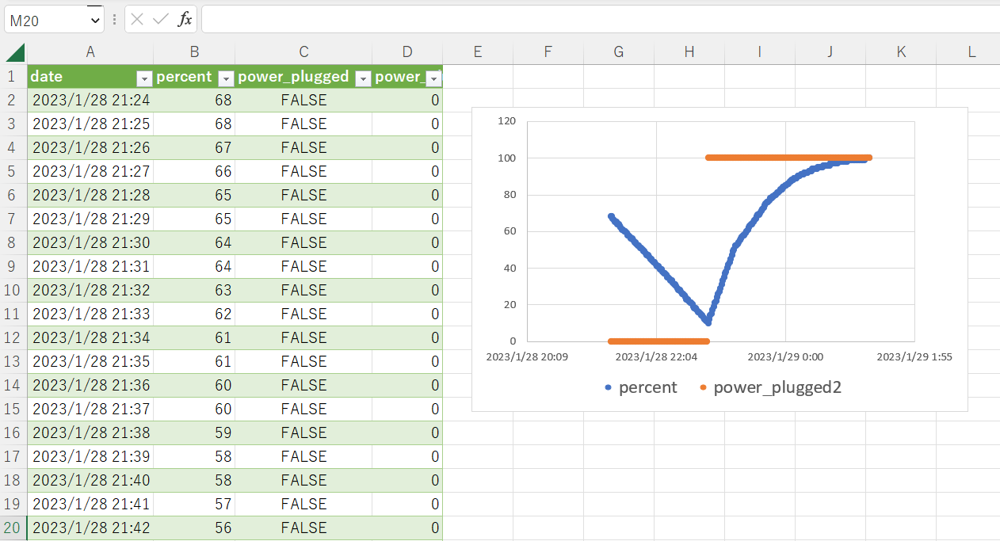

# バッテリー自動監視

[Latest Release Note](https://github.com/torippy1024/battery-watch/releases/latest)

[exeファイルのダウンロードはこちらから](https://github.com/torippy1024/battery-watch/releases/latest/download/BATTERY_WATCH_windows.exe)


## 概要

PCのバッテリー残量などを監視してくれるWindows向けソフトです。

実行中、一定間隔で（デフォルトでは１分に１回）PCの「バッテリー残量」と「電源プラグを繋いでいるかどうか」と「日時」を`battery.csv`に出力します。

Excelで開いてグラフ化すると、下の画像のようにPCのバッテリー残量履歴を良い感じに確認できます。



* なんかバッテリーの減りが早い気がする…
* バッテリー残量が急に減るときがある…
* でもPC標準機能じゃバッテリー残量履歴を確認できない or １時間おきのデータしか見れない…
* Windowsユーザー

といった方におすすめです。


# 出力例

```csv:battery.csv
date,percent,power_plugged
2023-01-28 21:24:15.855651,68,False
2023-01-28 21:25:16.518790,68,False
2023-01-28 21:26:17.150094,67,False
2023-01-28 21:27:17.826591,66,False
2023-01-28 21:28:18.454926,65,False
2023-01-28 21:29:19.130648,65,False
2023-01-28 21:30:19.841103,64,False
2023-01-28 21:31:20.473912,64,False
2023-01-28 21:32:21.105453,63,False
2023-01-28 21:33:21.703658,62,False
2023-01-28 21:34:22.375940,61,False
```


## 使い方

1. 以下のリンクからexeファイルをダウンロードします。
https://github.com/torippy1024/battery-watch/releases/latest/download/BATTERY_WATCH_windows.exe

1. ダウンロードした`BATTERY_WATCH_windows.exe`をダブルクリックで実行します。

1. 黒いコンソールが立ち上がります。

1. コンソールが立ち上がっている間は、一定間隔で（デフォルトでは１分に１回）`battery.csv`にバッテリー情報が書き込まれていきます。
1. 終了したいときは、コンソールで `Ctrl+C` を入力してください。
